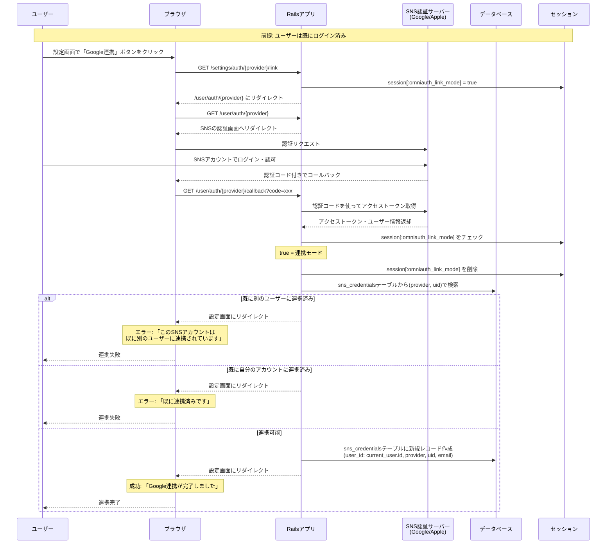

# アカウント連携

既にログイン済みのユーザーが、追加の認証手段としてSNS認証を連携する機能

## 概要

- メールアドレス認証でログイン済みのユーザーが、Google/Apple認証を追加連携できる
- SNS認証でログイン済みのユーザーが、別のSNS認証を追加連携できる
- 連携後は、どちらの認証方法でもログインできるようになる

## シーケンス図

### ログイン済みユーザーのSNS連携フロー



## 実装の要点

### 1. 連携モードの判定方法

#### セッションを使って連携モードを判定する

SNSプロバイダーからのコールバックURLは固定（例: `/user/auth/google/callback`）のため、専用のコールバックエンドポイントを作ることが出来ない。
そのため、セッションに連携モードフラグを保存し、コールバック時に判定する。

- `session[:omniauth_link_mode]`で連携モードを判定
- `session.delete(:omniauth_link_mode)`で使用後は即座に削除

### 2. 連携時のバリデーション

- `(provider, uid)`の組み合わせが別のユーザーに紐付いていないかをチェック
- 既に自分自身で連携済みなのに再度連携しようとしてないかをチェック

### 3. UI設計

#### 設定画面の表示例

```text
【連携済みアカウント】

✓ メールアドレス認証
  example@example.com

✓ Google認証
  example@gmail.com
  [連携解除]

[ Apple認証を連携する ] ← /settings/auth/apple/link へのリンク
```

## エラーハンドリング

### 連携時のエラー

- **SNSアカウント重複**: `(provider, uid)`が既に別のユーザーに連携されている
  - 例: 既に別のアカウントでGoogle連携済みのGoogleアカウントを連携しようとした場合
- **既に連携済み**: 同じSNSアカウントを重複して連携しようとした場合
- **ログイン状態切れ**: 連携フロー中にセッションが切れた場合
- **APIエラー**: SNS認証サーバーからのエラー
  - ネットワークエラー
  - 無効な認証コード
  - トークン取得失敗
- **ユーザーが認証をキャンセル**: SNSプロバイダーの認証画面でキャンセルした場合

### 連携解除時のエラー

- **最後の認証手段**: 唯一の認証手段を解除しようとした場合
  - 少なくとも1つの認証手段を残す必要がある

## リダイレクトURI設定

### Google認証

- 連携開始URI: `/settings/auth/google/link`
- OmniAuth開始URI: `/user/auth/google`（連携開始URIから自動リダイレクト）
- コールバックURI: `/user/auth/google/callback`

### Apple認証

- 連携開始URI: `/settings/auth/apple/link`
- OmniAuth開始URI: `/user/auth/apple`（連携開始URIから自動リダイレクト）
- コールバックURI: `/user/auth/apple/callback`

## 認証成功・失敗時の遷移先

- 連携成功: 設定画面（`settings_path`）へリダイレクト
  - フラッシュメッセージ: 「Google連携が完了しました」
- 連携失敗: 設定画面（`settings_path`）へリダイレクト
  - フラッシュメッセージにエラー内容を表示
- ログイン状態切れ: サインイン画面（`sign_in_path`）へリダイレクト
  - フラッシュメッセージ: 「ログインが必要です」
