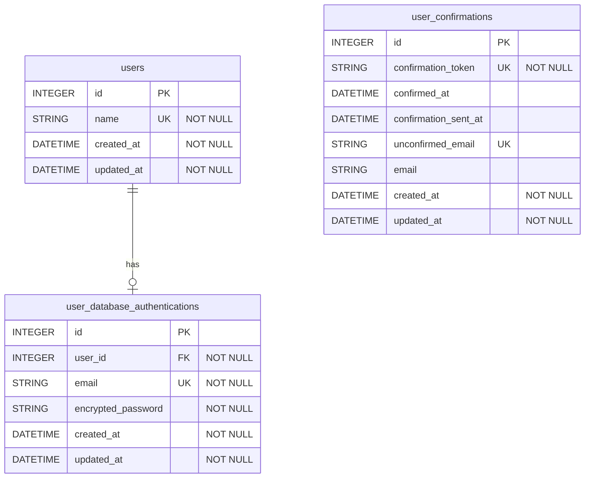
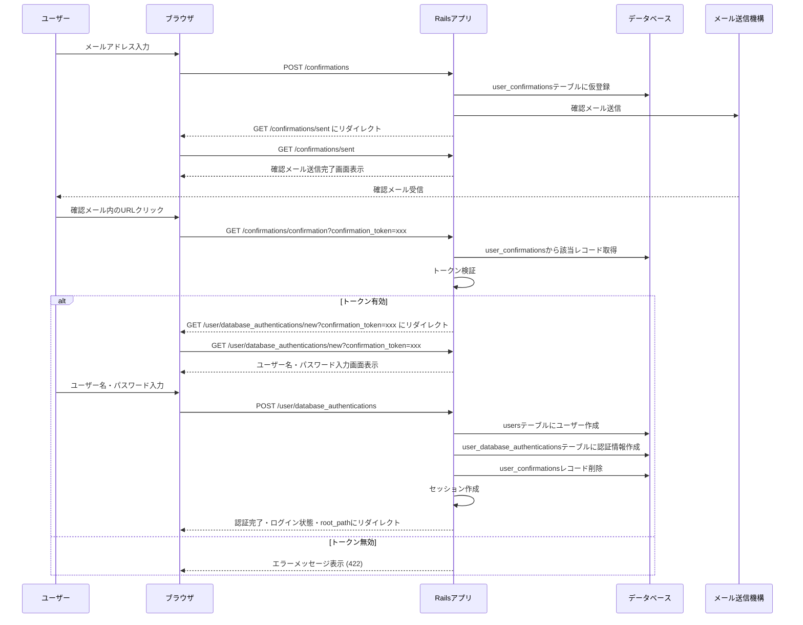
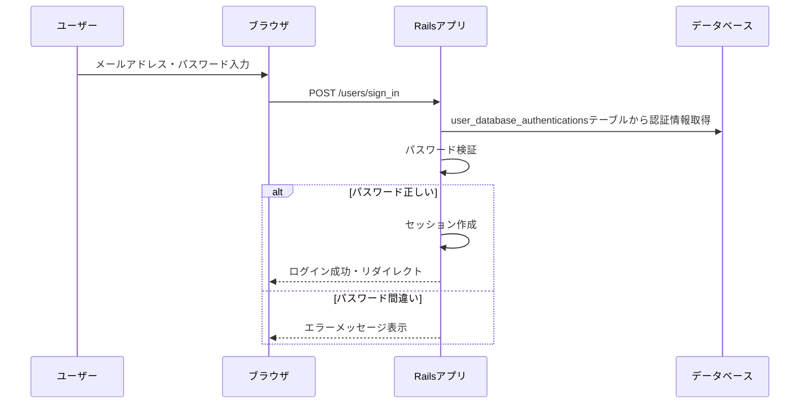

# メール認証

- メールアドレスとパスワードを登録して認証する
- メールアドレスの存在確認用のメールを送信して、認証用URLにアクセスされたら初めてユーザーを登録出来るようになる

## ER図

- user_confirmationsについて
  - 認証が完了したら使う用途がないデータなので、すぐに破棄する
  - unconfirmed_emailはメールの認証がされると、deviseの処理の中でnilとして保存され直すのでnullableになっている
- database_authenticationとusersテーブルは分離している理由について
  - 認証方法としてソーシャルログインも加えるため、メールアドレス認証を利用しないユーザーもいる
  - 現状はuserとdatabase_authenticationは1:1の関係だが、1:多にしたくなるかもしれないので予めテーブルを分離しておく

## シーケンス図

### Sign Up (新規登録)
- 「メール送信機構」はActionMailerやSMTPサーバーなどメール送信に関わるもの
  - フローに含めると煩雑になるのでひとまとめにしている

### Sign In (ログイン)

## エラーハンドリング

### Sign Up時のエラー
- メールアドレス重複 → `user_database_authentications.email`のユニーク制約違反
- バリデーションエラー → パスワード要件未満、メール形式不正
- メール送信失敗 → SMTP設定エラー、ネットワーク障害

### Sign In時のエラー
- メールアドレス未登録 → `user_database_authentications`テーブルにレコード不存在
- パスワード不一致 → `encrypted_password`との照合失敗
- アカウントロック → 連続ログイン失敗（実装予定）

### 確認メール関連のエラー
- トークン期限切れ → `confirmation_sent_at`から指定した有効期限を過ぎるとトークン期限切れになる
- 無効なトークン → `confirmation_token`が存在しない

## セキュリティ仕様

### パスワード要件
- 最小6文字以上

### 確認トークン
- 確認トークン有効期限：30分
  - メールアドレス認証は確認メール送信から30分を超えるとトークンが無効になる
