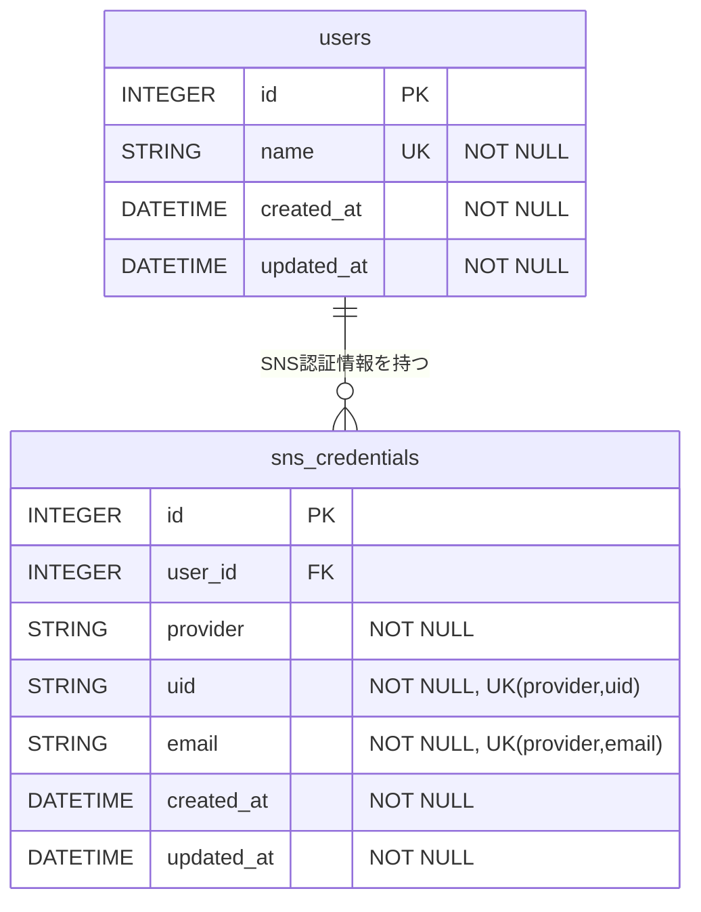
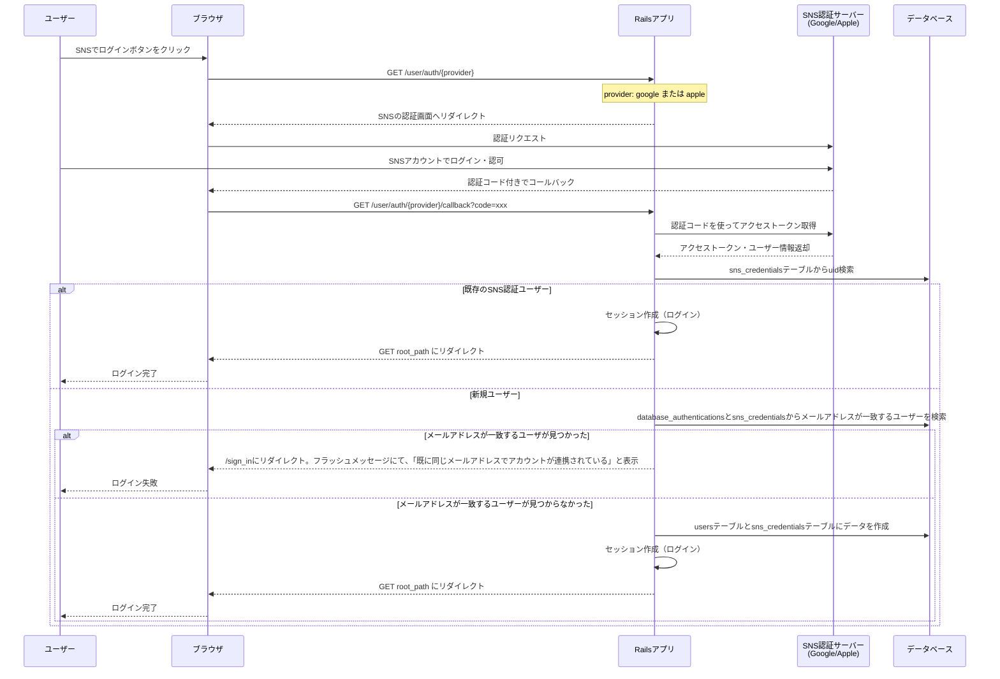

# SNS認証

- SNSのアカウントを利用してログインする機能
- パスワードを登録してログインする必要がない

## ER図

## シーケンス図

### SNS認証フロー（Google / Apple共通）

## エラーハンドリング

### SNS認証時のエラー

- メールアドレス未認証 → SNSプロバイダー側でメールアドレスが未認証の場合、認証失敗として処理
- APIエラー → Googleの認証APIがエラーを返した場合
  - ネットワークエラー
  - 無効な認証コード
  - トークン取得失敗
- ユーザーが認証をキャンセル → SNSプロバイダーの認証画面でキャンセルした場合
- メールアドレス重複 → `sns_credentials.email`のユニーク制約違反

### 認証失敗時の挙動

- 認証が失敗した場合はサインイン画面（`/sign_in`）にリダイレクト
- エラーメッセージをフラッシュメッセージで表示

## リダイレクトURI設定

### Google認証

- 認証開始URI: `/user/auth/google`
- コールバックURI: `/user/auth/google/callback`

### Apple認証

- 認証開始URI: `/user/auth/apple`
- コールバックURI: `/user/auth/apple/callback`

## 認証成功・失敗時の遷移先

- 認証成功(既存ユーザー): `root_path` へリダイレクト
- 認証成功(新規ユーザー): 登録画面に行き、ユーザー名の入力を行う
- 認証失敗: `/sign_up` （新規登録画面）へリダイレクト
