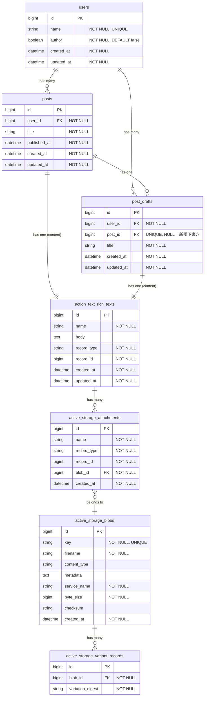

# ブログ機能のER図

## ER図

## テーブル説明

| テーブル                          | 説明                                                                       |
|-----------------------------------|----------------------------------------------------------------------------|
| `posts`                           | 公開済みブログ記事                                                         |
| `post_drafts`                     | 下書き。`post_id`がNULLなら新規、設定されていれば公開記事の編集中下書き    |
| `action_text_rich_texts`          | リッチテキスト本文（ポリモーフィック関連）                                 |
| `active_storage_attachments`      | 添付ファイルの中間テーブル                                                 |
| `active_storage_blobs`            | ファイルメタデータ                                                         |
| `active_storage_variant_records`  | 画像バリアント（リサイズ等）のキャッシュ                                   |

## 関連

- `Post`, `PostDraft` → `has_rich_text :content` でAction Textと関連
- Action Text内の画像は `ActiveStorage::Attachment` / `Blob` で管理

## ポリモーフィック関連について

Action TextとActive Storageは**ポリモーフィック関連**で紐づいています。
外部キーではなく `record_type` + `record_id` の組み合わせで任意のモデルに関連付けます。

### Action Text（リッチテキスト本文）

`Post`が`has_rich_text :content`を宣言すると、`action_text_rich_texts`に以下のように保存されます：

| record_type | record_id | name    | body           |
|-------------|-----------|---------|----------------|
| Post        | 123       | content | 本文のHTML...  |

### Active Storage（埋め込み画像）

Action Text内に画像を埋め込むと、`ActionText::RichText`モデルが内部で持つ`has_many_attached :embeds`により、`active_storage_attachments`に以下のように保存されます：

| record_type          | record_id | name   | blob_id |
|----------------------|-----------|--------|---------|
| ActionText::RichText | 456       | embeds | 789     |

## 運用フロー

1. **新規下書き作成**: `post_drafts` に `post_id = NULL` で作成
2. **新規公開**: 下書きから `posts` を作成し、下書きの `post_id` に公開記事のIDを設定（下書きは削除せず保持）
3. **公開記事の編集**: 紐づいた下書き（`post_id` が設定済み）を編集
4. **編集反映**: 下書きの内容で `posts` を更新

※ 下書きは公開後も保持され、公開記事の編集用として再利用される
