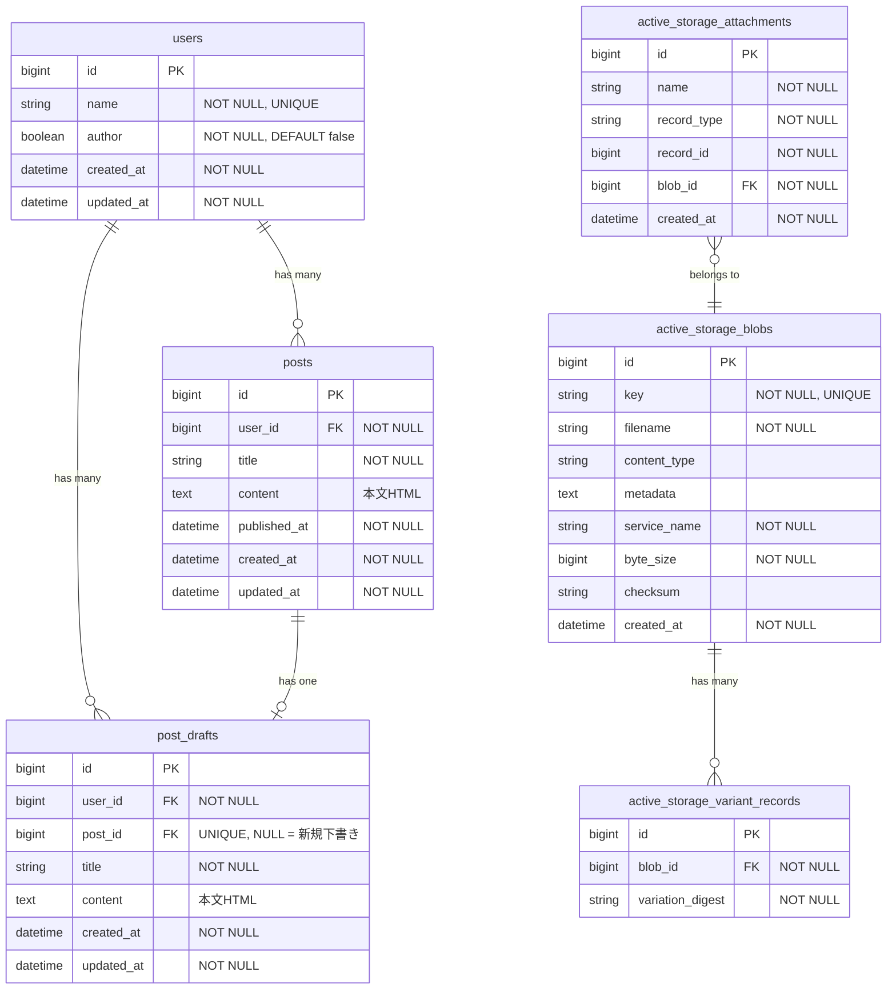

# ブログ機能のER図

## ER図

## テーブル説明

| テーブル                          | 説明                                                                       |
|-----------------------------------|----------------------------------------------------------------------------|
| `posts`                           | 公開済みブログ記事。本文は `content` カラムにHTMLで保存                    |
| `post_drafts`                     | 下書き。`post_id`がNULLなら新規、設定されていれば公開記事の編集中下書き    |
| `active_storage_attachments`      | 添付ファイルの中間テーブル（将来のアバター等で使用予定）                   |
| `active_storage_blobs`            | アップロードファイルのメタデータ                                           |
| `active_storage_variant_records`  | 画像バリアント（リサイズ版）のキャッシュ                                   |

## 本文の保存方式

本文（content）は `posts` / `post_drafts` テーブルの `text` カラムに直接HTMLとして保存されます。

- **エディタ**: Tiptap（WYSIWYGエディタ）
- **保存形式**: HTML文字列
- **表示時**: `sanitize` ヘルパーでXSS対策（許可タグのみ通過）

### 画像のアップロード

1. エディタで画像をアップロード
2. `EditorImagesController` が受け取り、`ActiveStorage::Blob` に保存
3. 最大1200x1200pxに縮小したvariantのURLを返却
4. 本文HTML内に `` として埋め込み

※ 画像は `active_storage_blobs` に直接保存され、`active_storage_attachments` は使用しない（孤立Blob）

### 画像サイズの調整

- エディタで幅（px）を指定可能
- HTMLの `width` 属性として保存
- 表示時にCSSでリサイズ

## 運用フロー

1. **新規下書き作成**: `post_drafts` に `post_id = NULL` で作成
2. **新規公開**: 下書きから `posts` を作成し、下書きの `post_id` に公開記事のIDを設定（下書きは削除せず保持）
3. **公開記事の編集**: 紐づいた下書き（`post_id` が設定済み）を編集
4. **編集反映**: 下書きの内容で `posts` を更新

※ 下書きは公開後も保持され、公開記事の編集用として再利用される
