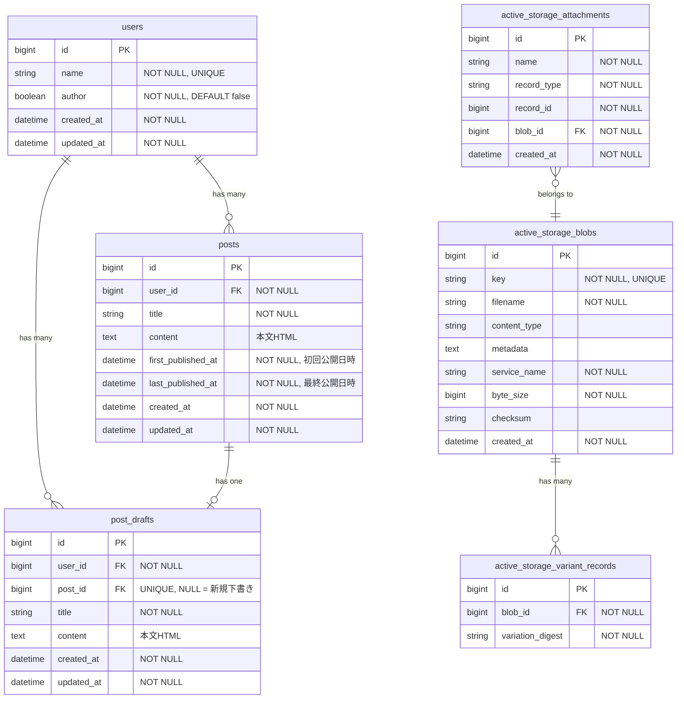

# ブログ機能のER図

## ER図

## テーブル説明

| テーブル                          | 説明                                                                       |
|-----------------------------------|----------------------------------------------------------------------------|
| `posts`                           | 公開済みブログ記事。本文は `content` カラムにHTMLで保存                    |
| `post_drafts`                     | 下書き。`post_id`がNULLなら新規、設定されていれば公開記事の編集中下書き    |
| `active_storage_attachments`      | 添付ファイルの中間テーブル（将来のアバター等で使用予定）                   |
| `active_storage_blobs`            | アップロードファイルのメタデータ                                           |
| `active_storage_variant_records`  | 画像バリアント（リサイズ版）のキャッシュ                                   |

## 本文の保存方式

本文（content）は `posts` / `post_drafts` テーブルの `text` カラムに直接HTMLとして保存されます。

- **エディタ**: Tiptap（WYSIWYGエディタ）
- **保存形式**: HTML文字列
- **表示時**: `sanitize` ヘルパーでXSS対策（許可タグのみ通過）

### 画像のアップロード

1. エディタで画像をアップロード
2. `EditorImagesController` が受け取り、`ActiveStorage::Blob` に保存
3. 最大1200x1200pxに縮小したvariantのURLを返却
4. 本文HTML内に `` として埋め込み

※ 画像は `active_storage_blobs` に直接保存され、`active_storage_attachments` は使用しない（孤立Blob）

## ライフサイクル

### post_drafts（下書き）

| 操作 | タイミング | 詳細 |
| ------ | ------------ | ------ |
| **作成** | 新規下書き作成時 | `post_id = NULL` で作成。著者が「新規下書き」ボタンを押下 |
| **作成** | 記事編集時（下書きなし） | 記事一覧から「編集」ボタン押下時、下書きが存在しなければ記事の内容から作成 |
| **更新** | 下書き保存時 | 「保存」ボタン押下で `title`, `content`, `updated_at` を更新 |
| **更新** | 初回公開時 | `post_id` に公開された記事のIDが設定される |
| **削除** | 著者による削除時 | 下書き一覧から「削除」ボタン押下。紐づく `posts` は削除されない |

### posts（公開記事）

| 操作 | タイミング | 詳細 |
| ------ | ------------ | ------ |
| **作成** | 初回公開時 | 下書き一覧から「公開」ボタン押下。`first_published_at` と `last_published_at` に現在時刻を設定 |
| **更新** | 公開内容更新時 | 下書き一覧から「更新」ボタン押下。`title`, `content`, `last_published_at` を更新（`first_published_at` は不変） |
| **削除** | 著者による削除時 | ユーザーの記事一覧から「削除」ボタン押下。紐づく `post_drafts.post_id` は `NULL` にならない（下書きも削除される想定） |

### アクションと更新対象

| アクション | 更新されるテーブル | 備考 |
| ------------ | ------------------- | ------ |
| 下書き作成 | `post_drafts` (INSERT) | 新規レコード作成 |
| 保存 | `post_drafts` (UPDATE) | title, content を更新 |
| 公開 | `posts` (INSERT), `post_drafts` (UPDATE) | posts 作成、post_id を設定 |
| 下書き保存 | `post_drafts` (UPDATE) | title, content を更新。posts は変更なし |
| 更新を公開 | `posts` (UPDATE) | title, content, last_published_at を更新 |
| 記事編集 | `post_drafts` (INSERT or なし) | 下書きがなければ記事の内容から作成、あればそのまま |
| 下書き削除 | `post_drafts` (DELETE) | 公開済みの場合、posts は残る |
| 記事削除 | `posts` (DELETE) | post_drafts は残る |

### 運用フロー

1. **新規下書き作成**: `post_drafts` に `post_id = NULL` で作成
2. **下書き保存**: `post_drafts` の `title`, `content` を更新
3. **初回公開**: 下書きから `posts` を作成し、下書きの `post_id` に公開記事のIDを設定
4. **公開後の編集**: 紐づいた下書きを編集・保存（`posts` は変更されない）
5. **更新を公開**: 下書きの内容で `posts` を更新し、`last_published_at` を現在時刻に設定
6. **記事一覧から編集**: 記事一覧の「編集」ボタンから下書き編集画面へ遷移。下書きが削除されていた場合は記事の内容から再作成

※ 下書きは公開後も保持され、公開記事の編集用として再利用される
